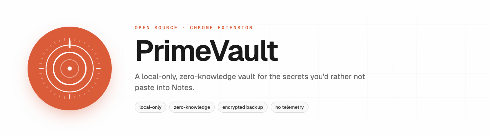
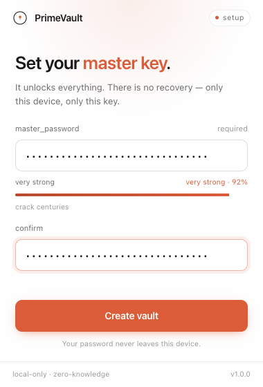
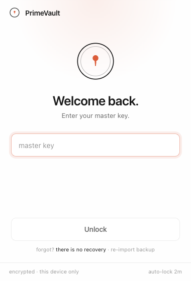
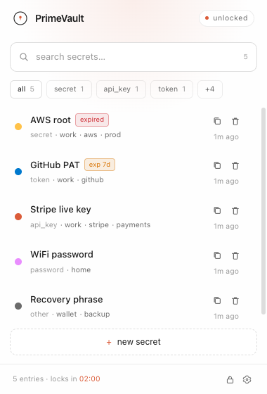
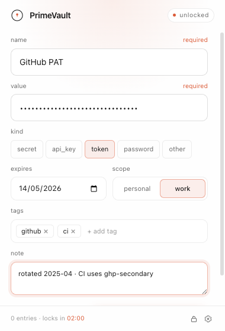
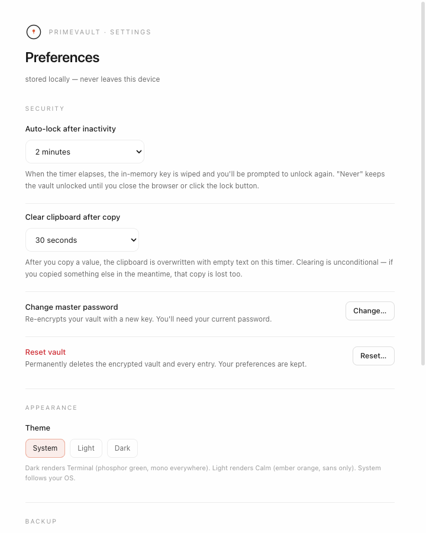

<picture>
  <source media="(prefers-color-scheme: dark)" srcset="docs/brand/readme-hero-dark.png">
  
</picture>

# PrimeVault

> Encrypted Chrome extension vault for API keys & tokens. Zero-knowledge, open source, lives in your toolbar.

[](https://github.com/prime0x2/PrimeVault/actions/workflows/ci.yml)

PrimeVault is a small, auditable Chrome extension for developers who routinely paste API keys, tokens, and secrets between terminals, browsers, and dashboards. Click the toolbar icon, unlock with your master password, copy what you need, get back to work.

- **Zero-knowledge:** the master password never leaves your device. The vault is encrypted client-side with AES-256-GCM under a PBKDF2-derived key.
- **No accounts, no servers:** zero network requests. Audit the source.
- **Local-only:** the encrypted vault lives in `chrome.storage.local`. Nothing is synced.
- **Auto-lock + clipboard auto-clear:** configurable idle timer wipes the in-memory key; configurable clipboard timer overwrites copied secrets.
- **Encrypted backup:** export your vault to a file, restore on a new machine.
- **Open source, MIT-licensed.**

Full design and threat model: [`specs/2026-05-04_spec.md`](./specs/2026-05-04_spec.md). Privacy policy: [`PRIVACY.md`](./PRIVACY.md). Store listing copy: [`STORE_LISTING.md`](./STORE_LISTING.md).

**Jump to:** [Install](#install-unpacked-pre-store) · [Tour](#tour) · [Develop](#develop) · [Build](#build-and-package) · [Quality](#quality) · [Contributing](#contributing) · [Privacy](#privacy-and-security)

## Status

**v1.0.0 — feature complete; pending Chrome Web Store submission.** The release artifact is built and tagged; the only remaining step is the manual store submission, which lives outside this repo. Until that lands, [Install (unpacked, pre-store)](#install-unpacked-pre-store) below is the supported install path.

340 unit tests passing across 39 files. CI runs typecheck, lint, test, and build on every PR.

## Install (unpacked, pre-store)

Until PrimeVault is approved on the Chrome Web Store, you can run it as an unpacked extension from a tagged release:

1. Grab `primevault-<version>-chrome.zip` from the [latest release](https://github.com/prime0x2/PrimeVault/releases/latest). It's the asset attached to the release — not the auto-generated **Source code** archives, which don't contain a built extension.
2. Unzip it somewhere stable. Chrome reads the extension from this folder on every browser start, so don't drop it in `~/Downloads` and forget about it.
3. Open `chrome://extensions`, toggle **Developer mode** on (top right).
4. Click **Load unpacked** and select the unzipped folder (the one with `manifest.json` at its root).
5. Pin the toolbar icon and use `⌘⇧K` (Mac) / `Ctrl+Shift+K` (Win/Linux) to open it. Rebind at `chrome://extensions/shortcuts` if Chrome doesn't pick up the default.

To update, delete the unzipped folder, drop in the new release's contents, and click **Reload** on the extension card. Your encrypted vault lives in `chrome.storage.local` and survives across reloads as long as the extension keeps the same load path.

If you'd rather build from source, see [Develop](#develop) and [Build and package](#build-and-package) below.

## Tour

A walkthrough of the five surfaces you'll touch, in the order you'll meet them. Screenshots are from a real build; nothing has been retouched.

### 1. First run — set your master key



The first time you open the popup it asks you to set a master password. This password derives the key that encrypts your vault. **There is no recovery and no reset that preserves your data** — if you forget it, the encrypted blob is just bytes. The strength meter (powered by `zxcvbn-ts`) shows an estimated crack time; pick something the meter rates "strong" or better, then confirm and click **Create vault**.

### 2. Returning visits — unlock



Every time the auto-lock timer fires, the browser restarts, or you click the lock icon, you'll see this. Type your master password and hit **Unlock**. The decrypted key lives in memory only — never on disk. If you've lost the password and have an encrypted backup file, **re-import backup** (bottom right) will let you re-create the vault from the backup's own key.

### 3. The vault — your secrets, one toolbar away



The main surface. Each row is one entry — name, kind chip, scope, tags, last-used time, plus a copy and a delete button. Type in the search bar to filter by name or tag, or click the kind chips below it (`secret`, `api_key`, `token`, …) to narrow by type. Expiry pills (`expired`, `exp 7d`) make it obvious which keys need rotating. Click a row to expand it: full value, notes, and an Edit button. Click the copy icon to put the value on the clipboard with the auto-clear timer running.

The footer shows entry count and the live auto-lock countdown — when it hits zero, the in-memory key is wiped and you're back to the unlock screen.

### 4. Adding (or editing) an entry



Click **+ new secret** from the vault list. Name and value are required; everything else is metadata that helps Future You find this thing again:

- **kind** — secret / api_key / token / password / other; drives the row icon.
- **expires** — optional date; the list will badge the row as `expired` (past) or `exp Nd` (within 14 days).
- **scope** — personal vs work, for filtering.
- **tags** — short labels; up to 10.
- **note** — free text for context (rotation cadence, related env vars, etc.).

Editing an entry uses the same form pre-filled.

### 5. Settings



The gear icon (next to the lock, bottom right of the popup) opens settings in a full tab. From here you can:

- **Auto-lock** — how long of inactivity before the in-memory key is wiped. `Never` keeps it unlocked until the browser closes.
- **Clear clipboard after copy** — overwrites the clipboard N seconds after you copy a value. `Never` disables the timer.
- **Change master password** — re-encrypts the vault under a new key.
- **Reset vault** — wipes the encrypted blob and every entry. Preferences stay.
- **Theme** — System (default), Light (Calm: ember orange on near-white), or Dark (Terminal: phosphor green on warm-black).
- **Backup** (further down the page) — encrypted export, encrypted import, and plaintext export (with a deliberate warning).

Encrypted exports use the same envelope as the live vault, so a backup file is portable across machines as long as you remember its password.

## Stack

- [WXT](https://wxt.dev) (extension framework) + React 19 + TypeScript 5
- Tailwind CSS v4 + custom token-driven primitives in `src/components/{terminal,form}.tsx`
- Two-theme palette: **Terminal** (phosphor green on warm-black) for dark, **Calm** (ember orange on near-white) for light. System preference is the default.
- WebCrypto (PBKDF2-SHA256, AES-256-GCM)
- `zxcvbn-ts` for password strength scoring (lazy-loaded; not in the steady-state popup bundle)
- Vitest for unit tests, Biome for lint+format, pnpm for installs
- GitHub Actions for CI

## Develop

```sh
pnpm install
pnpm dev          # Chrome with HMR (auto-launches a persistent dev profile)
pnpm dev:firefox  # Firefox with HMR
```

The first `pnpm dev` creates a persistent profile under `.wxt/chrome-data/` so the unlocked vault, settings, and onboarding state survive between runs. Delete that directory to test the first-run flow on a fresh state.

If `pnpm dev` ever fails with `ENOENT: no such file or directory, open '.wxt/chrome-data/chrome-out.log'`, it means the profile dir got cleaned (e.g. `wxt clean` or fresh checkout). The `dev` script auto-creates it, so just rerun.

### Keyboard shortcut

Default: `⌘⇧K` (Mac) / `Ctrl+Shift+K` (Win/Linux). Bound on first install. If Chrome ever drops the binding (it can after manifest changes in dev), rebind at `chrome://extensions/shortcuts` under the row labeled **"Activate the extension."**

## Build and package

```sh
pnpm build        # production build → .output/chrome-mv3/
pnpm zip          # zipped artifact ready for the Chrome Web Store
```

A Firefox build (`pnpm build:firefox` / `pnpm zip:firefox`) compiles cleanly and runs locally via `pnpm dev:firefox`, but PrimeVault isn't published on AMO yet — Chrome is the only supported install target for now.

## Quality

```sh
pnpm compile      # tsc --noEmit (typecheck)
pnpm lint         # Biome check (lint + format + import order)
pnpm lint:fix     # auto-fix
pnpm test         # vitest run
pnpm test:watch   # watch mode
pnpm test:coverage
```

CI runs these four (compile, lint, test, build) on every PR.

## Manual QA — fresh-profile checklist

Before any release, exercise the full flow against a production build in a fresh Chrome profile. The dev profile accumulates state that can mask "I assumed prior state" bugs.

1. `pnpm build`
2. New Chrome profile or `rm -rf .wxt/chrome-data` then `pnpm dev`
3. Onboard: create a vault with a strong master password
4. Add an entry with notes, tags, and an expiry date
5. Expand the row, copy the value, edit it, delete it
6. Search by name and by tag
7. Lock manually; unlock; try with the wrong password
8. Wait for auto-lock to fire
9. Copy a value; close the popup; verify the clipboard auto-clears at the configured timeout
10. Settings: change theme, change auto-lock duration, change clipboard-clear duration
11. Settings: change master password; lock; unlock with the new password
12. Settings: encrypted export → reset vault → encrypted import → entries restored
13. Settings: plaintext export (acknowledge the warning)
14. Settings: reset vault; verify popup returns to onboarding

If any step deviates from expected behavior, that's a release blocker.

## Repository layout

See [`specs/2026-05-04_spec.md`](./specs/2026-05-04_spec.md) §14 for the full layout. Briefly:

```
src/
  entrypoints/      # popup, options, background SW, offscreen doc
  features/         # unlock, vault, options, backup, passwords
  components/       # terminal.tsx (popup atoms), form.tsx (options primitives)
  crypto/           # PBKDF2 + AES-GCM + envelope
  storage/          # client + vault + prefs + migrations + schema
  messaging/        # protocol + client + server + session + clipboard
  styles/           # theme.css — CSS-var palette + theme switch
  lib/              # ulid, tags, theme, cn
tests/              # mirrors src/, vitest unit tests
.github/workflows/  # CI
```

## Contributing

Issues and PRs welcome. Before submitting:

1. Run `pnpm compile && pnpm lint && pnpm test` — these are what CI runs.
2. New features should land with tests. The repo has 300+ tests as a baseline; please don't shrink that.
3. UI changes should preserve accessibility (every interactive element keyboard-reachable and labeled).
4. Crypto changes need extra care. Read [`specs/2026-05-04_spec.md`](./specs/2026-05-04_spec.md) §3 (threat model) and §4 (cryptographic design) first; flag the change in the PR description.

For substantive design changes, open an issue first to discuss before writing code.

## Privacy and security

PrimeVault makes no network requests, has no host permissions, and ships no third-party trackers. Your data never leaves your device. Full policy: [`PRIVACY.md`](./PRIVACY.md).

If you discover a security issue, please email **prime0x2@gmail.com** rather than opening a public issue.

## License

MIT — see [`LICENSE`](./LICENSE).
