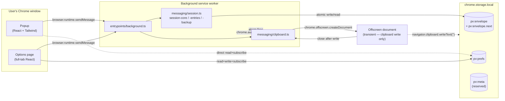
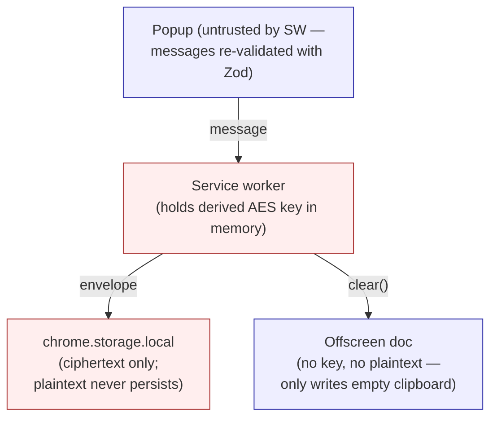
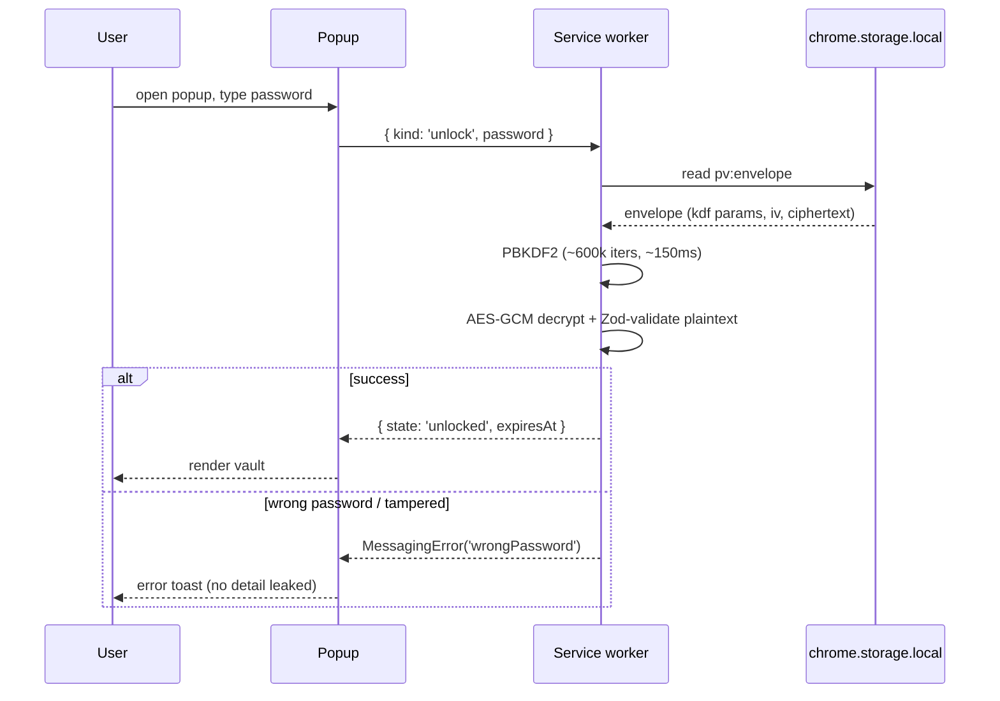
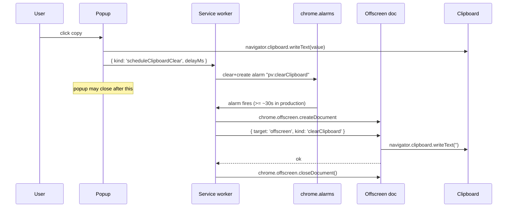

# PrimeVault — Architecture

A one-page map of how the pieces fit together. For full design rationale see
[`specs/2026-05-04_spec.md`](../specs/2026-05-04_spec.md); this doc is the
shape, not the why.

## Component diagram

## Trust boundaries

The master password and the derived AES-GCM key are visible only inside
the service worker process. Plaintext entries are decrypted on demand,
returned over the messaging protocol to the popup, and never persisted.

## Lifecycle of an unlock

## Lifecycle of a copy with auto-clear

## Key files by layer

| Layer | Where | Notes |
|---|---|---|
| Crypto | `src/crypto/` | `kdf.ts` (PBKDF2), `aead.ts` (AES-GCM), `envelope.ts` (versioned wrapper, AAD-bound) |
| On-disk format | `src/storage/` | `vault.ts` (atomic write+swap), `prefs.ts`, `migrations.ts`, `prefs-hook.ts` (shared subscribe) |
| Wire protocol | `src/messaging/protocol.ts` | Zod schemas for every message, validated on both sides |
| Session | `src/messaging/session*.ts` | `session-core.ts` (key holder + helpers), `-entries.ts` (CRUD), `-backup.ts` (export/import), `session.ts` (lifecycle) |
| Messaging client | `src/messaging/client.ts` + `popup-client.ts` | Typed `send` |
| Clipboard auto-clear | `src/messaging/clipboard.ts` + `entrypoints/offscreen/main.ts` | DI'd over `chrome.alarms` + `chrome.offscreen` |
| UI | `src/features/{vault,unlock,options,backup,passwords}/` | React components grouped by feature |
| UI primitives | `src/components/terminal.tsx` (popup atoms) + `src/components/form.tsx` (options primitives + shared `<Alert>`) | Token-driven, no shadcn |
| Theme | `src/styles/theme.css` | OKLCH dark palette + RGB-hex light palette, swapped via `:root.dark` / `:root.light` / `prefers-color-scheme` |

## Where decisions are recorded

- **Threat model + crypto**: spec §3, §4. Includes what we *don't* defend against.
- **On-disk format**: spec §5–§6.
- **Wire protocol**: spec §7. JSDoc on `protocol.ts` mirrors it.
- **Auto-lock + clipboard timer**: spec §7.2, §10.4.
- **Tradeoffs from the senior review**: [`specs/2026-05-05_review-tasks.md`](../specs/2026-05-05_review-tasks.md).
